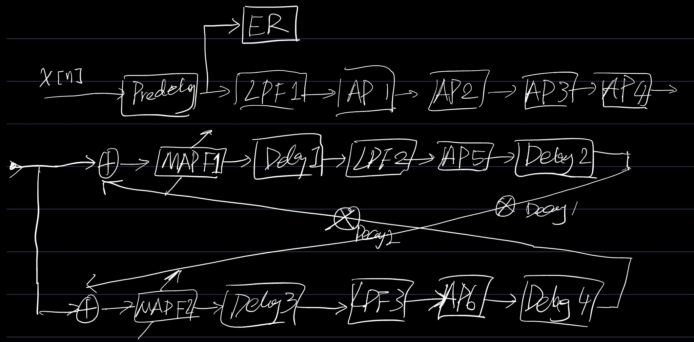
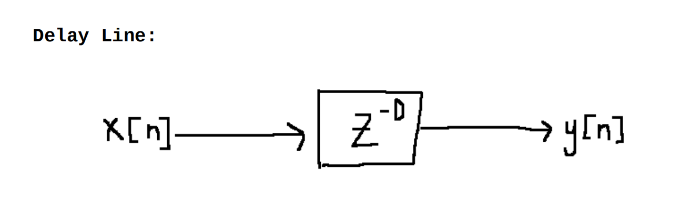
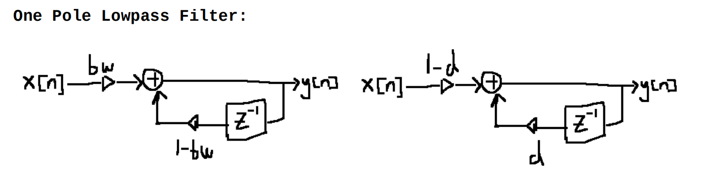
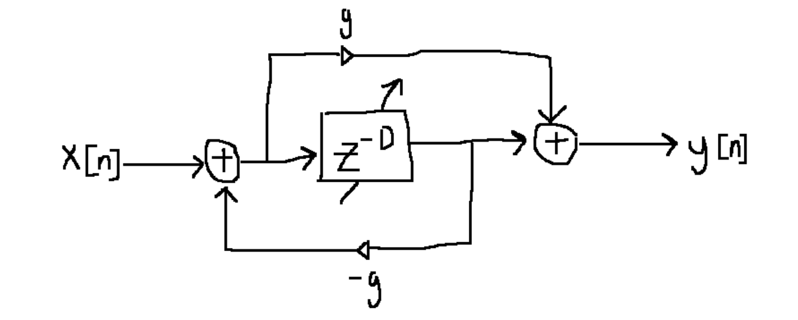
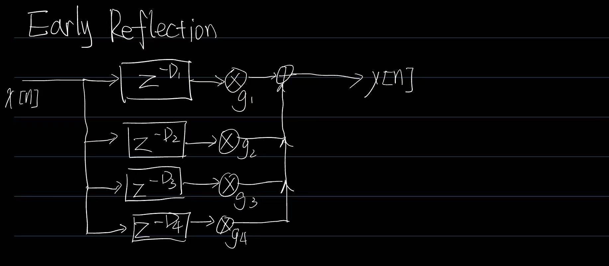

# DattorroReverb
A  plate reverb inspied by Dattorro's reverb design

---

## Overview

This project implements an algorithmic reverb engine from scratch in C++. The design combines:

- **Early Reflections** using a multi-tap delay line.
- **Diffusion** using cascaded allpass filters to avoid high order filter's unstability.
- **Dual feedback tanks** for dense late reverberation. With decay params and Lowpass filters inside to mimic attenuating reverb tail.
- **Modulated allpass filters** to reduce metallic ringing. Use sine wave modulation with low frequency and linear interpolation for fractional delay line.
- **Block-based processing** for real-time-friendly audio flow. And sample by sample processing in every block.
- **Mixing** mix dry signal, early reflection and wet reverb tail together with adjustable ratios.
- **Soft Clipping** by tanh function for output.

The project supports both:

- **Offline WAV rendering** using `libsndfile`
- **Real-time style block processing** through a reusable `ReverbEngine` class

---

## Architecture
### Overall

The overall signal flow is:

### Delay Line

### Two One-pole Lowpass Filters

### (Modulated) IIR Allpass Filter

LFO: sine wave with adjustable freq and amp by **sine table lookup** method, leading to the delay line interpolated by **linear interpolation**.

### Early Reflection (Self-defined)

### Output

**Tail Output** using tap methods:

y_L = delay1[394] + delay1[4401] – apf5[2831] + delay2[2954] – delay3[2945] – apf6[277] - delay4[1066]   
y_R = delay3[522] + delay3[5368] – apf6[1817] + delay4[3956] – delay1[3124] – apf5[496] - delay2[179]

**Final Output** using mixing method:

 outL = output_gain_ * (dry_ratio_ * x + er_ratio_ * er_L + tail_ratio_ * wetL)  
outR = output_gain_ * (dry_ratio_ * x + er_ratio_ * er_R + tail_ratio_ * wetR)

### Adjustable Params(Suggested)

decay1_,
decay2_,
dry_ratio_,
er_ratio_,
tail_ratio_,
output_gain_,
drive,
kBlockSize.

## Note
- It takes **mono** audio signal as input, and output **stereo** signal.
- The "snare.wav" and "snare_reverb_with_er.wav" show the effect of this reverb.
- The block Processing has not been tested in real-time and haven't used SIMD optimization yet.

## Reference
Dattorro, Jon; 1997; Effect Design, Part 1: Reverberator and Other Filters [PDF]; CCRMA, Stanford University, Stanford, CA; Paper ;  Available from: https://aes.org/publications/elibrary-page/?id=10160